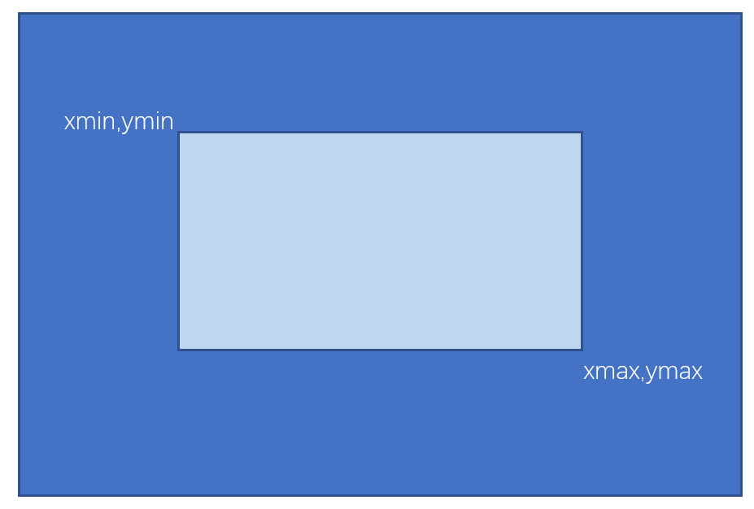
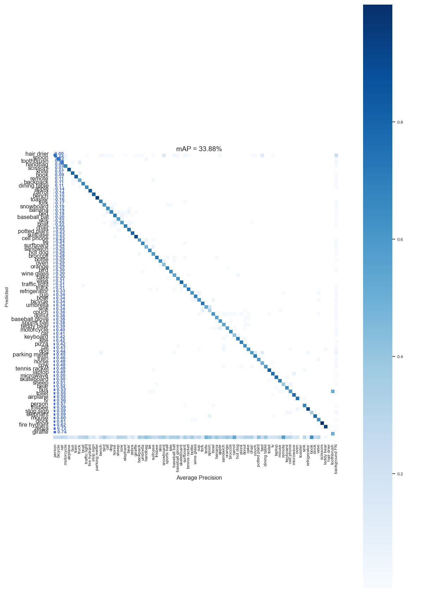

## mAP
### Calculate mAP of detection result and groundtruth

`
pytorch=1.8.1
` 
the groundtruth dir contains truth labels, the predict dir contains predicted labels. 
### Preparation
groundtruth dir: eachfile respond to a image with "label xmin ymin xmax ymax"  
predict dir:eachfile respond to a image with "label xmin ymin xmax ymax score"  
(xmin, ymin) is left-top coordinate, (xmax, ymax) is right-bottom coordinate 
 
### Run
`
python mAP.py
`
 

precision_recall_curve
 
 
 
confusion matrix
 

### reference
[https://github.com/ultralytics/yolov3](https://github.com/ultralytics/yolov3) 
[https://github.com/Cartucho/mAP](https://github.com/Cartucho/mAP)