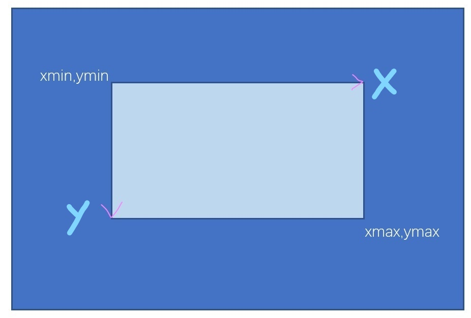
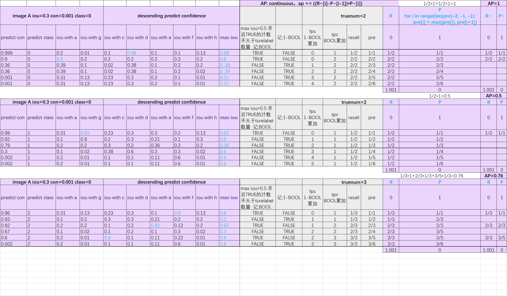
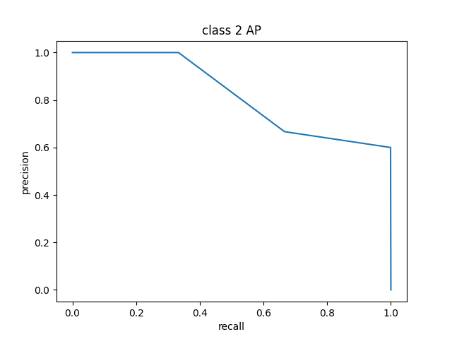

## mAP
### update-2023
I rewrite some codes, It can be more better to understand, so should use `mAP_myself.py` this file to calculate or understand 
There is a new parameter `min_confidence` to ignore those prediction below confidence threshold. 
### Calculate mAP of detection result and groundtruth

`
pytorch=1.8.1
`  
the groundtruth dir contains truth labels, the predict dir contains predicted labels. 

### Preparation
groundtruth dir: each file correspond to a special image with "label xmin ymin xmax ymax"  
predict dir: each file correspond to a special image with "label xmin ymin xmax ymax score"  
(xmin, ymin) is left-top coordinate, (xmax, ymax) is right-bottom coordinate 
 

### Run
`
python mAP.py
` 

precision_recall_curve
 
 

### Process
 

### Calculating mAP example
turelabels 
 

prediction 
 

calculation 
 

results 
     

### Reference  
[https://github.com/ultralytics/yolov3](https://github.com/ultralytics/yolov3) 
[https://github.com/Cartucho/mAP](https://github.com/Cartucho/mAP)

### Mainpage  
[https://blog.csdn.net/m0_50617544/article/details/121893818](https://blog.csdn.net/m0_50617544/article/details/121893818) 
[https://zhuanlan.zhihu.com/p/449822471](https://zhuanlan.zhihu.com/p/449822471)