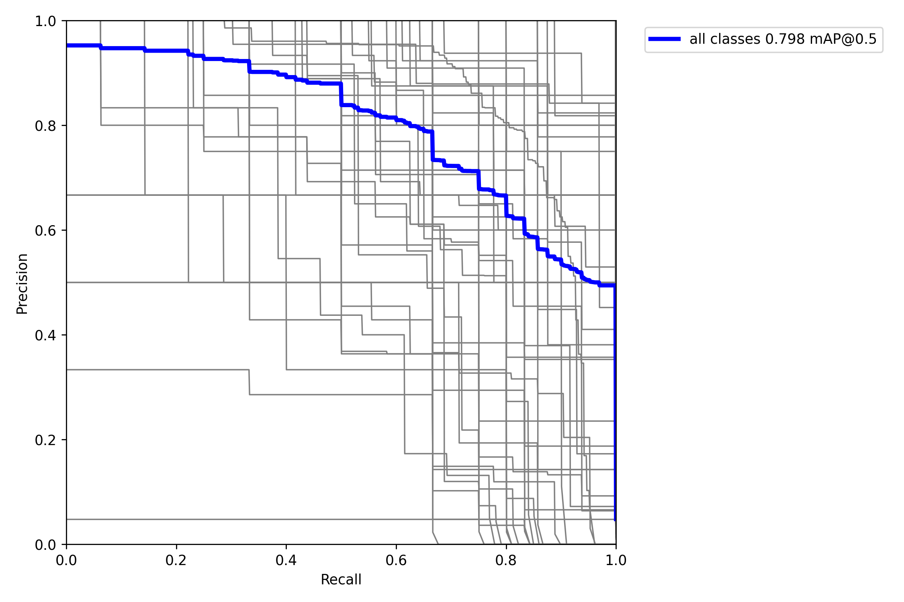

## mAP
### Calculate mAP of detection result and groundtruth

`
pytorch=1.8.1
`  
the groundtruth dir contains truth labels, the predict dir contains predicted labels. 

### Preparation
groundtruth dir: each file correspond to a special image with "label xmin ymin xmax ymax"  
predict dir: each file correspond to a special image with "label xmin ymin xmax ymax score"  
(xmin, ymin) is left-top coordinate, (xmax, ymax) is right-bottom coordinate 
 

### Run
`
python mAP.py
` 

precision_recall_curve
 
 

### Process
 

### Reference  
[https://github.com/ultralytics/yolov3](https://github.com/ultralytics/yolov3) 
[https://github.com/Cartucho/mAP](https://github.com/Cartucho/mAP)