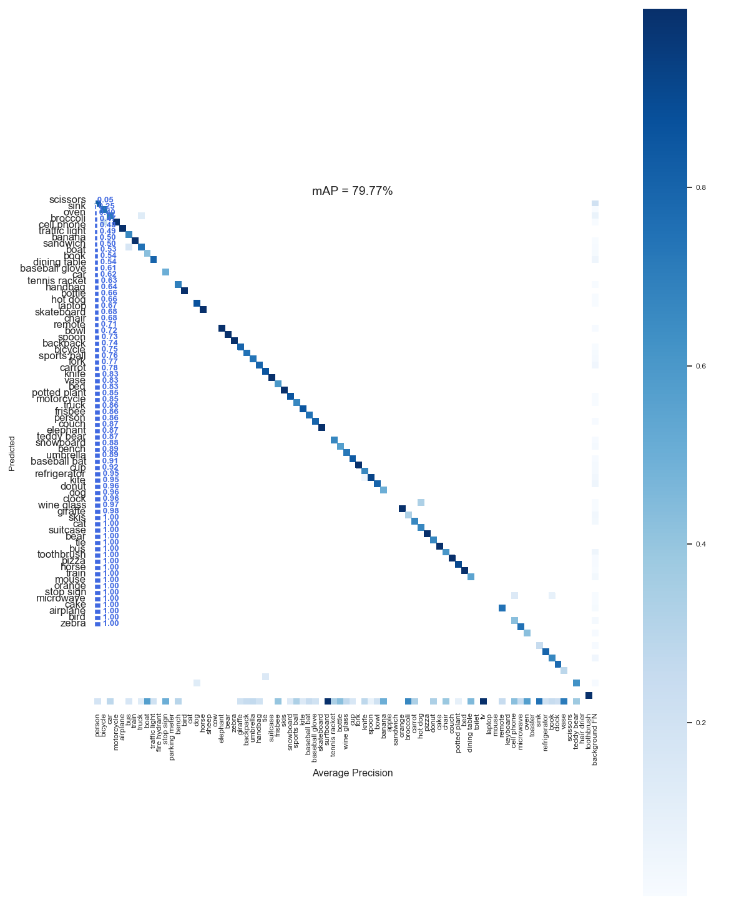

## mAP
### Calculate mAP of detection result and groundtruth

`
pytorch=1.8.1
`

### Preparation
groundtruth dir: eachfile respond to a image with "label xmin ymin xmax ymax"  
predict dir:eachfile respond to a image with "label xmin ymin xmax ymax score"  

### Run
`
python mAP.py
`
 
                    
confusion matrix
                                           
precision_recall_curve

### reference
[https://github.com/ultralytics/yolov3](https://github.com/ultralytics/yolov3) 
[https://github.com/Cartucho/mAP](https://github.com/Cartucho/mAP)